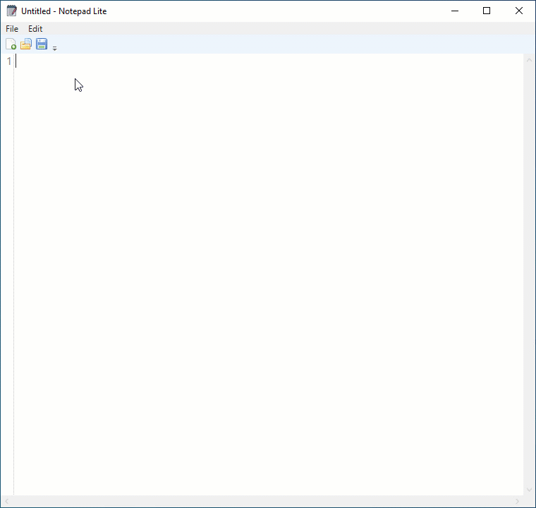

# Notepad Lite
A simple notepad in WPF
The intention of this project is to demonstrate the MVP architecture pattern in WPF.
Though it is a very simple project, it contains lots of WPF best practices. So, feel free to check the source code.

